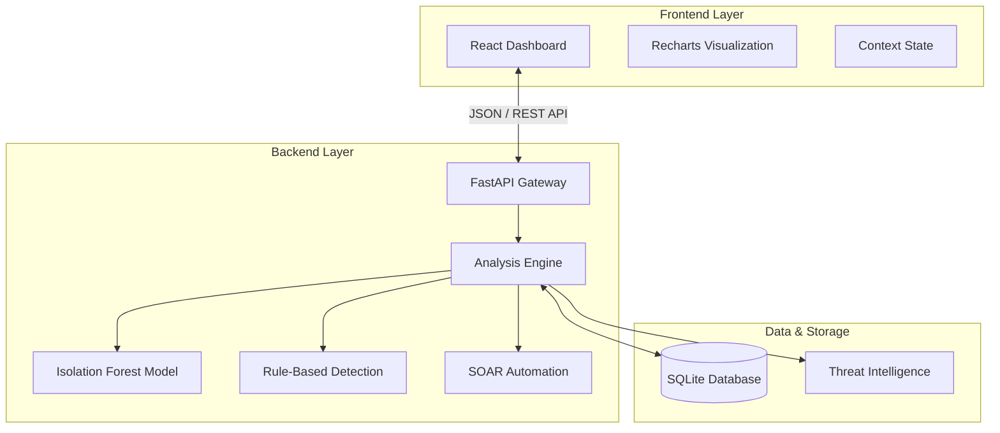
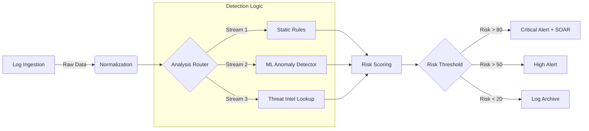

# 🛡️ Titan-SIEM SIEM

> **Next-Generation Security Information and Event Management**  
> *Real-time Threat Detection | Machine Learning Anomaly Detection | Automated Incident Response*


---

## 🧠 System Architecture

Titan-SIEM utilizes a microservices-inspired architecture for high-performance security monitoring.



---

## 🌊 Threat Detection Pipeline

The core of Titan-SIEM is its hybrid detection engine, combining rule-based heuristics with unsupervised machine learning.



### Risk Scoring Matrix
The system calculates a cumulative risk score based on multiple weighted factors:

| Factor | Weight | Description |
|--------|--------|-------------|
| **Anomaly Score** | +50 | Behavioral anomaly detected by ML engine |
| **Threat Intel** | +90 | Known malicious IP or signature match |
| **Critical Asset** | x1.5 | Multiplier for assets like Payment Gateway |
| **Lateral Movement** | +60 | Suspicious sequential access patterns |

---

## 🎮 Live Simulation & Advanced Features

### 1. **Real-time Attack Simulation**
**File:** `live_demo.py`

The system includes a sophisticated simulation engine that generates real-time traffic, security threats, and hardware telemetry. This allows for testing the system under various load conditions and attack vectors.

#### Supported Scenarios:
| Category | Scenario | Description | Risk Level |
|----------|----------|-------------|------------|
| **Network** | **DDoS Attack** | High-volume UDP flood from single IP | 🔴 Critical |
| **Network** | **Port Scan** | Systematic connection attempts to multiple ports | 🟠 High |
| **App Sec** | **SQL Injection** | Malicious payloads targeting WAF | 🔴 Critical |
| **App Sec** | **Brute Force** | Repeated failed login attempts detected by rules | 🟠 High |
| **App Sec** | **Error Spikes** | Burst of 500 Internal Server Errors | 🟡 Medium |
| **Hardware** | **Overheating** | Temperature limit violation triggers | 🟠 High |
| **Hardware** | **Disk Failure** | SMART error simulation | 🔴 Critical |

**Running the Simulation:**
```bash
python3 live_demo.py
# Press Ctrl+C to stop
```

---

### 2. **System Management Utilities**
**File:** `clean_and_start.sh`

A utility script is provided to completely reset the environment and restart services.

**Capabilities:**
- Stops all running services (Backend, Frontend, Demo)
- **Wipes the database** (`sentinel.db`) for a fresh start
- Restarts Backend (Port 8000) and Frontend (Port 5173) in background

**Usage:**
```bash
./clean_and_start.sh
```

---

### 3. **Enhanced Security Modules**

#### Application Security (AppSec)
**Endpoint:** `/api/v1/dashboard/app-stats`
- **WAF Monitoring**: Tracks SQLi and XSS attempts
- **User Behavior**: Monitors active sessions and high-risk users
- **Stability**: Tracks HTTP 500 error rates in real-time

#### Hardware Health Monitoring
**Endpoint:** `/api/v1/dashboard/hardware-stats`
- **Telemetry**: Real-time CPU load, fan speed, and temperature
- **Predictive Maintenance**: Detects disk failures and overheating risks before they become critical.

---

## 📦 Installation & Setup

### Prerequisites
- **Python:** 3.8+
- **Node.js:** 16+

### Quick Start
```bash
# 1. Clone Repository
git clone https://github.com/ph453-z3r0/Titan-SIEM.git
cd Titan-SIEM

# 2. Setup Backend
cd backend
pip install -r requirements.txt
python -m uvicorn app.main:app --reload --port 8000 &

# 3. Setup Frontend
cd ../frontend
npm install
npm run dev

# 4. Access Dashboard
# Open http://localhost:5173
```

---

## 📚 Technical Stack

Start your development journey with these core technologies:

| Layer | Technology | Version | Purpose |
|-------|------------|---------|---------|
| **Frontend** | React | 19.2.0 | Declarative UI framework |
| | Vite | 7.2.4 | Next-generation frontend tooling |
| | Tailwind CSS | 4.1.18 | Utility-first CSS framework |
| | Recharts | 2.15.0 | Composable charting library |
| **Backend** | FastAPI | Latest | Modern, fast web framework |
| | SQLModel | Latest | Database ORM + Pydantic |
| | Scikit-learn | Latest | Machine Learning tools |
| | Uvicorn | Latest | ASGI web server |

---

## 🛡️ License

This project is licensed under the MIT License - see the [LICENSE](LICENSE) file for details.

**Built with ❤️ for Security Operations Centers**